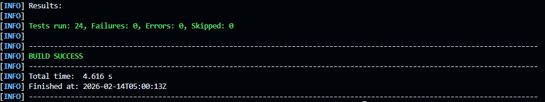

# Laboratorio de Principios SOLID en Java

## 👥 Elaborado por

- Laura Daniela Rodríguez Sánchez

## 🎯 Principios SOLID Implementados

### 1. SRP - Single Responsibility Principle (Principio de Responsabilidad Única)

**Patrones de diseño que se pueden implementar:**
- Separation of Concerns (SoC)

### 2. OCP - Open/Closed Principle (Principio Abierto/Cerrado)

**Patrones de diseño que se pueden implementar:**
- Strategy Pattern

### 3. LSP - Liskov Substitution Principle (Principio de Sustitución de Liskov)

**Patrones de diseño que se pueden implementar:**
- Interface Segregation
- Composition

### 4. ISP - Interface Segregation Principle (Principio de Segregación de Interfaces)

**Patrones de diseño que se pueden implementar:**
- Interface Segregation
- Role Interface Pattern

### 5. DIP - Dependency Inversion Principle (Principio de Inversión de Dependencias)

**Patrones de diseño que se pueden implementar:**
- Dependency Injection (DI)
- Inversion of Control (IoC)

## 🧪 Ejecución de Tests

Todos los principios SOLID están cubiertos con **31 tests unitarios** que validan las implementaciones correctas.

### Resultados

